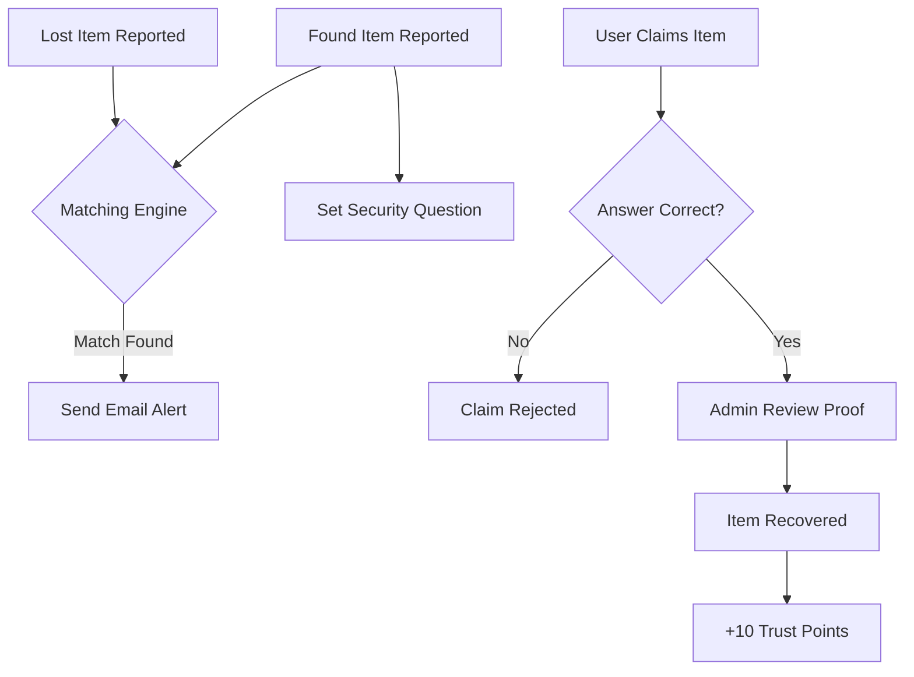

# 🛡️ Lost Guard - Advanced University Lost & Found App

**Lost Guard** is a premium, campus-aware full-stack platform designed to reconnect students and staff with their lost belongings through intelligent matching, secure blind-question verification, and real-time community trust.

---

## 🌟 Advanced University Features

### 🧠 Smart Campus Matching Engine

Automatically suggests "Found" items to users based on specific SLIIT Malabe Blocks (e.g., NAB, Computing, Engineering). The matching algorithm uses **Category + Location Block** precision to increase recovery rates.

### 🔒 Blind Question Verification

Secure your found items with a challenge. Reporters can set a security question (e.g., *"What sticker is on the back?"*). Claimants must provide the correct answer before they can proceed with a formal claim.

### 🏆 Guardian Leaderboard

Gamifying honesty! Users earn **Trust Points** for successful recoveries. The top 10 "Guardians" are showcased on a premium leaderboard to encourage community participation.

### 📍 Dynamic Metadata Management

Campus locations, item categories, and location blocks are fully managed via the **Admin Dashboard**. This allows the platform to adapt to new buildings or categories without code changes.

### 🏥 Verified Drop-off Hubs

Items can be marked as **"Secured at Hub"** (e.g., Security Gate 1, Student Affairs). A shield badge on the item ensures the student that their item is safe and ready for pickup.

### 🕰️ Auto-Archiving Timeline

Prevents platform clutter. Once an item is successfully marked as recovered, it enters a 1-hour grace timeline before being automatically swept into a secure, read-only "Historical Archives" Vault accessible via the user's profile.

### 💎 Premium Experience Architecture

#### ☁️ Universal Floating UI

A standardized, responsive header and menu system that persists across all app states. Features include context-aware action buttons (Dynamic Share, Moderation Add) and high-quality blur-glassmorphism.

#### ⚡ Zero-Lag Performance Engine

Deeply optimized startup sequence using staggered data-loading and `InteractionManager` orchestration. The interface remains 100% interactive even while the system processes heavy background data.

#### 🎨 Smart-Blur Styling (Android Optimized)

An intelligent rendering engine that prioritizes visual fidelity on iOS while falling back to high-performance semi-transparent layers for list items on Android, keeping the app smooth at 60fps across all devices.

### 🛡️ Infinite Admin Oversight

Complete CRUD control over user networks. Administrators can intercept, edit, or delete platform users while actively pulling up and wiping out any specific listing attached to a targeted account natively from the dashboard.

---

## 🔄 System Workflows

### **Item Recovery Lifecycle**

### **Verification Workflow**

1. **Finder**: Sets a "Blind Question" during the found report.
2. **Claimant**: Must provide the correct string answer to view the owner's contact info.
3. **Admin**: Validates the secondary physical proof (image) before final closure.

---

## 🗄️ Database Architecture (MongoDB Atlas)

The system utilizes a structured NoSQL schema for high flexibility and performance:

- **`users`**: Authentication, profile data, and the `trustScore` gamification field.
- **`items`**: Core reports containing `locationBlock`, `isAtHub`, and `verificationQuestion` fields.
- **`claims`**: Linking users to items with proof and approval statuses.
- **`categories`**: Dynamic list of item types for filtering.
- **`locations`**: Campus-specific building and block mapping.
- **`statusLogs`**: Persistent audit trail for every status change (Reported -> Hub -> Recovered).
- **`notifications`**: Real-time in-app alerts for matches.

---

## 👥 Users & Roles

| User Type | Permissions | Description |
| :--- | :--- | :--- |
| **User** | Report, Search, Claim, Chat | General students seeking belongings. |
| **Admin** | User & Metadata CRUD, View/Wipe Listings, Moderate Claims | Campus staff governing the overarching platform. |
| **Guardian** | Top Ranks, Verified Status | High-trust users with high recovery scores. |

---

## 🚀 Module Mapping

### 🔍 Member 1: Item Management & Discovery

- **Dynamic Categories**: Fetching real-time categories/locations from DB.
- **Smart Discovery**: "Suggested for You" carousel based on active lost items.
- **Cloudinary Integration**: Secure, high-performance image hosting.

### 🛡️ Member 2: Claim & Verification

- **Blind Challenge**: Implementation of the security question workflow.
- **Verification Logic**: Server-side answer validation for claim submissions.
- **Trust Scores**: Backend logic for calculating and awarding trust points.

### 📧 Member 3: Communication & Notification

- **Watchlist Notifications**: Automated email alerts for category/block matches.
- **Real-time Chat**: Glassmorphism chat UI for finder-claimant coordination.
- **Mail Service**: Nodemailer integration with premium university-branded templates.

### 📜 Member 4: Tracking & Recovery

- **Verified Hubs**: Hub tracking system for physical item security.
- **Status Lifecycle**: Visual audit trail from "Reported" to "Secured at Hub" to "Recovered".
- **Leaderboard Engine**: Aggregation logic for community rankings.

---

## 🌐 Deployment Architecture

The application is deployed across a high-performance cloud infrastructure, fully supporting cross-platform access:

- **Frontend (Mobile)**: **Expo Cloud (EAS)**. OTA (Over-The-Air) deployment and seamless updates configured via GitHub Actions.
- **Frontend (Web App)**: **DigitalOcean App Platform**. The project is explicitly configured with `react-native-web` to compile into a highly optimized, responsive Single Page Application (SPA). Web-specific APIs, such as standard `localStorage` security fallbacks and native `Blob` file uploads, ensure a 100% bug-free desktop experience.
- **Backend API**: **Heroku PaaS**. Running the stateless Node.js Express server.
- **Database**: **MongoDB Atlas**. Managed cloud database with deep indexing for search.
- **Storage**: **Cloudinary**. Optimized image transformations and secure file hosting.

---

## 🛠️ Tech Stack & Setup

### **Backend Setup**

1. `cd backend` && `pnpm install`
2. Configure `.env` with Mongo, JWT, Cloudinary, and SMTP keys.
3. `pnpm start`

### **Frontend Setup (Mobile & Web)**

1. `cd frontend` && `pnpm install`
2. Configure `.env` with `EXPO_PUBLIC_API_URL` pointing to Heroku.
3. For local development: `pnpm start` (press `w` to open the Web App in your browser).
4. For Production Web Build: `npx expo export` (Requires DigitalOcean or static hosting of the `dist/` directory).

---

## 📂 Database Collections

- `users`: Includes `trustScore`.
- `items`: Includes `isAtHub`, `hubName`, `verificationQuestion`.
- `categories`: Dynamic metadata for item groups.
- `locations`: Campus location mapping with `block` grouping.
- `statusLogs`: Audit trail for recovery tracking.

---

## 📄 License

2nd Year WMT Module Assigment Submission. Creative Commons Zero v1.0 Universal.

Developed with ❤️ for the University Community.
