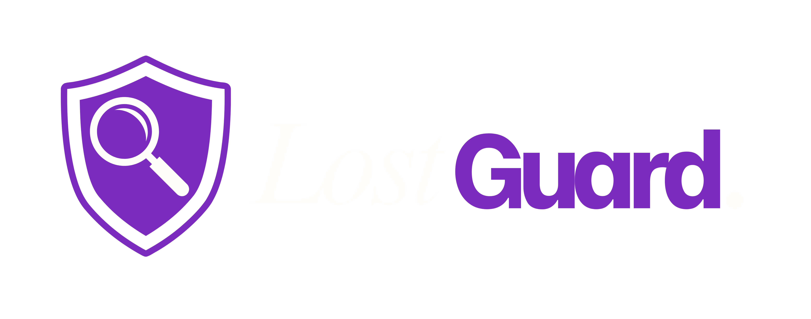

# 🛡️ Lost Guard - Advanced University Recovery Platform

**Lost Guard** is a premium, full-stack campus utility designed to reconnect students with lost belongings through intelligent matching, secure verification, and real-time physical tracking. It transforms the traditional "lost and found" into a high-trust community ecosystem.

---

## 💎 Premium "Level-Up" Features

### 🧠 Smart Campus Matching Engine

Our proprietary algorithm automatically suggests "Found" items to users based on **Category + Location Block** precision (e.g., NAB, Computing, Engineering). If you lose a "Blue Bottle" in "NAB Block B", the system alerts you the moment one is reported.

### 🔒 Blind Question Verification

Secure your found items with a challenge. Reporters set a security question (e.g., *"What sticker is on the back?"*). Claimants must provide the correct answer before they can see your contact details, preventing spam and false claims.

### 📍 Verified Drop-off Hubs

Items can be marked as **"Secured at Hub"** (e.g., Security Gate 1, Student Affairs). A shield badge on the listing ensures students that their item is safe and ready for physical pickup. Admins manage these official drop-off points live.

### 🏆 Guardian Leaderboard & Trust Scores

Gamifying honesty! Users earn **Trust Points** for successful recoveries and verified drop-offs. The top "Guardians" are showcased on a premium leaderboard to encourage community participation and ethical behavior.

### 🕰️ Auto-Archiving Vault

Once an item is marked as **Recovered**, it enters a 1-hour grace period before being automatically swept into a secure, read-only "Historical Archive" Vault, accessible via the user's profile to keep the main feed clean.

### 🎨 Premium Glass UI Design System

A state-of-the-art interface utilizing **Blur-Glassmorphism**. Features include:

- **GlassAlerts**: Custom themed notification pop-ups standardized across the app.
- **Floating UI**: Standardized header and persistent navigation menu.
- **Optimized Rendering**: High-performance layers ensuring 60fps scrolling on iOS and Android.

---

## 🛠️ Core Module Mapping (The 4 Members)

| Member | Module | Key Responsibilities |
| :--- | :--- | :--- |
| **1** | **Item Management** | CRUD Item Reports, Smart Matching recommendations, Category/Location metadata fetching. |
| **2** | **Claim & Verification** | Blind Question security logic, Proof image submission, Claim processing life-cycle. |
| **3** | **Communication** | Real-time finder-claimant messaging, Automated Email matches via Nodemailer. |
| **4** | **Tracking & Recovery** | Hub status oversight, Trust Score aggregation, Leaderboard engine, Archiving Vault. |

---

## 🔄 System Workflows

### **The Recovery Lifecycle**

1. **Lost Report**: User specifies location block and item category.
2. **Found Report**: Finder attaches image and sets a unique Blind Question.
3. **Smart Match**: System alerts the owner via email and in-app "Suggested for You" carousel.
4. **Claim-Verification**: User answers the Blind Question and submits secondary proof.
5. **Admin Review**: Admin verifies the physical proof and approves the claim.
6. **Archived**: After 1 hour of "Recovered" status, the item is moved to the Historical Vault.

---

## 🛡️ Master Admin Dashboard

The command center for platform administrators:

- **Metadata Management**: Live CRUD for campus buildings, blocks, and item categories.
- **Hub Control**: Create and monitor official Verified Hubs points.
- **User Moderation**: Monitor user trust scores and wipe out deceptive listings or fake accounts.
- **Stability Architecture**: Integrated with a live-sync engine to ensure data consistency across all users.

---

## 🌐 Tech Stack & Infrastructure

- **Backend**: Node.js Express Server (Stateless REST Architecture).
- **Database**: MongoDB Atlas (Managed Cloud Storage).
- **Storage**: Cloudinary (High-Performance Image Transformation & Storage).
- **Frontend**: Expo / React Native (Cross-Platform Mobile & Web Native).
- **Notifications**: Automated NodeMailer university-branded templates.

---

## 🚀 Setup & Deployment

1. **Clone the Repository**.
2. **Backend**:
   - `cd backend`
   - `pnpm install`
   - `pnpm start` (Requires `.env` with MONGO_URI, JWT_SECRET, CLOUDINARY, SMTP)
3. **Frontend**:
   - `cd frontend`
   - `pnpm install`
   - `pnpm start` (Requires `.env` with EXPO_PUBLIC_API_URL)

---

Developed with ❤️ for the University Community.
2nd Year WMT Module Assignment Submission.
 Creative Commons Zero v1.0 Universal.
